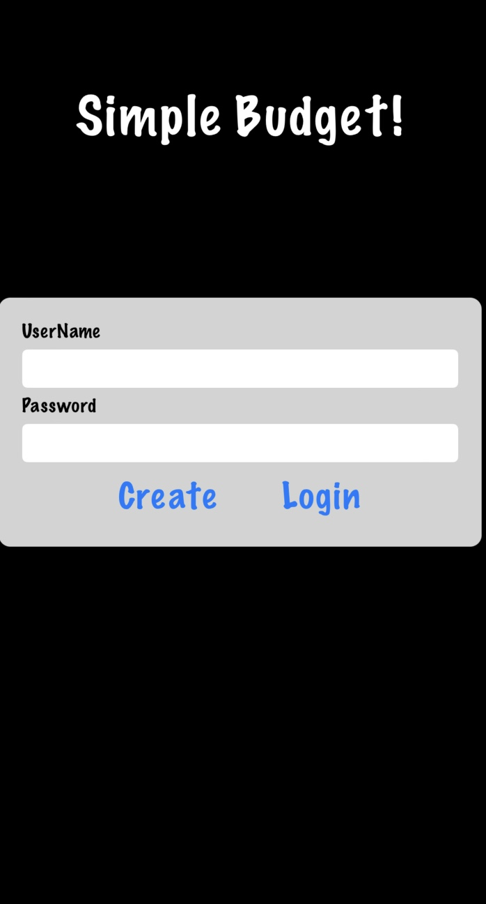

<h1>
   
  Easy Budget 
</h1>

  <h2 align="center">Another Budget App?!<h2>
  

Are you sick of overly complicated budget apps? Or maybe you've looked for simpler ones to find that they aren't all that simple,
the features don't really help you or it's just plain ugly to look at!  

Well, this app isn't beautiful (I'm not a designer), BUT, it is simple and actually answers the two top questions most people have.  

1. Do I have enough to pay my bills?
2. How much to I have left to buy other stuff?!

After much consideration and surveying, I found that people generally have 'two people' making the budget.
These two people have conflicting goals, so it never works! The first person is the adult in us. The one
that is responsible, wants to save, put away into our 401k, knock out the debt! The other is more like 
the fun kid, I mean the first guy sounded pretty boring.. This kid wants what he wants and doesn't want
to bother with a 'budget', thats just gross.  

We want to be responsible and have fun!

If you had endless money, a budget wouldn't matter much, so if you do, well you can skip this app.  

But if you don't, then buedgeting is good for both people. It's good for the adult because, well, he needs
to lighten up a bit. Life is no fun if you don't loosen up a bit and throw some money at that giant
lamma you've already dreamed of. On the other hand, the kid is having fun but starts to get pretty stressed
knowing he is about to get evicted because, well he bought 5 lamas before paying rent.  

## Installation
The app is currently written in Xamarin, though I do have plans to convert it to React Native in the future. It's also not currently on any app stores,
but that is coming, likely soon.  

I would recommend using Visual Studio (not vscode) to run the program. Outside of running the main file inside the VS, I don't think you
need anything else. If you want it to run on your smartphonek, well you'll need to create the APK (Android) or IPA (iOS). Sadly if you 
have an iPhone like me, you'll need an apple developer accont ($99/year) to run it on your phone. Apple...such rollercoast relationship we have.

## In Use (Coming Soon)

  
  

  

  
  

  

## License: 
Creative Commons Attribution-NonCommercial license (CC BY-NC)

## Credits:
I want to thank all the bad years of debt and headaches dealing with budgets to end to making this app. Would not recommend.

## Contact:
Dev: Michael Nunez (mnunez1013@gmail.com)
